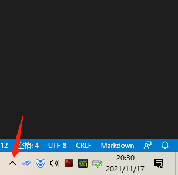
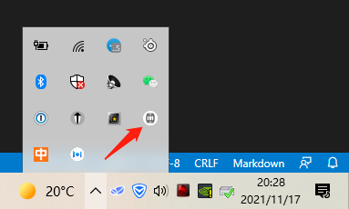
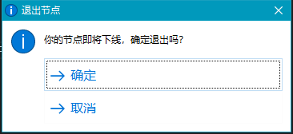
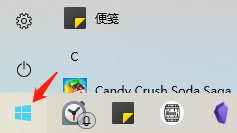
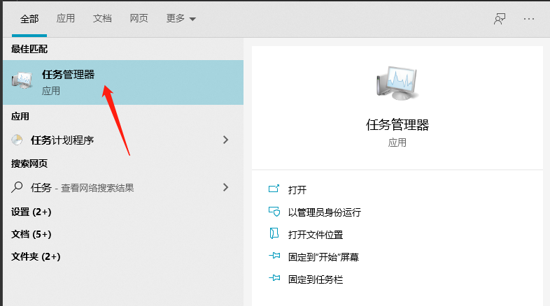
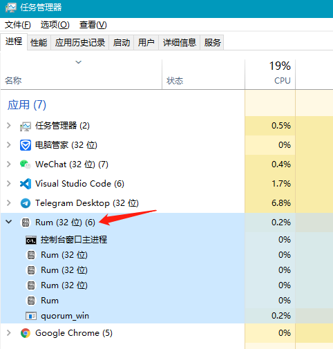
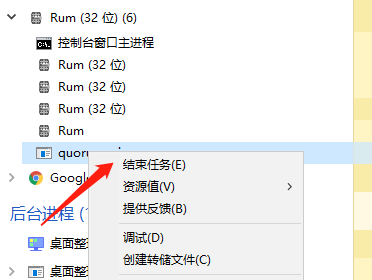

# debug

**调试**

本页面的操作指南为 debug 图文操作指南，请勿随意尝试，可在工作人员的指导下操作。

## logs

**导出调试包**

在 RUM 客户端的左上角，点击菜单`调试`-`导出调试包`，

将弹出“另存为”的窗口，左上角选择“桌面”（或者你能记住的位置），然后点击“保存”。

在桌面（或者你能记住的位置）找到刚才的 logs 文件，把它发给工作人员。

## exit

**手动退出RUM**

在你的电脑右下角，点击`^` 展开“系统托盘区”：

找到 Rum 的酒桶小图标：

鼠标右键点击它，在弹出的菜单中选择“退出”后，弹出一个退出确认窗口，选择“确定”，即可退出 Rum。

## kill

**手动杀掉进程**

在你的电脑左下角，点击windows图标，

然后输入任务管理器，点击它启动，

在任务管理器可以看到 rum 相关的应用/进程，

如果需要强制退出/杀掉进程，可以右键点击对应的 RUM 进程，选择“结束任务”。

