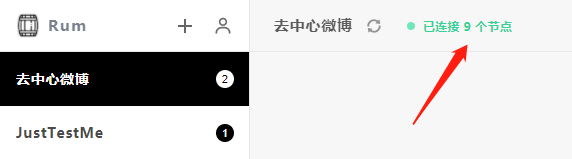

# 常见问题

## 我可以发布哪些内容？

原则上，您可以发布任何内容。

在您自己所创建的群组，或许您对该群组有一个定位，并期望所有的成员尽量遵循该定位去发布特定的内容。您可以向群成员作出这样的建议。

在您所加入的群组，建议试着先了解并遵循该群组的定位，然后再发布内容。

作为群组的创建者，您需要为该群组的内容负责，请您遵循当地的法律法规。

## 我所产生的数据会一直存在吗？

会。除非您卸载并删除本地 Rum 的安装目录，或未知 bug。

在使用 Rum 时，您所产生的数据将自动存储在您的本地电脑，同时所有在线组员也将自动同步并存储一份完整数据。

由于目前还是早期的技术测试，难免出现未知的异常bug。还请您注意对原创内容予以备份保管。

## 我发布的内容储存在哪里？

每个群组（group）的内容，保存在所有成员（peer）的电脑之中。

每个成员都拥有该群组的完整数据。

没有任何中心服务器保管这些数据，也无法查阅这些数据。

以此确保了您的数据隐私及安全。

## 群组内容是否可修改、可删除？

> 在Rum群组内发布的内容，是不是以区块链的方式记录，不可修改、不可删除？

群组内发布的内容，的确是以区块链的方式记录的，即组链 Group Chain。

如果想要实现部分内容的“删除”，链上数据是无法删除的，但这些内容可被隐藏。当前已经实现的有：群组创建人禁止组员发布内容后，该组员的内容将不会显示出来。未来将考虑支持隐藏指定内容。

如果想要实现群组所有内容的“删除”，这是可以办到的。全组人都想要放弃某个群组，那么所有成员不在线甚至删除了本地存储目录，那么这条组链也就自然消失了。当然啦，如果有任意组员在线，且它本地存储了该组链的数据，那么该群组就会继续存活。

## 群组数据越来越多后，如何解决新加入的同步效率？

> 当新人加入已经产生了许多数据的群组，同步数据所需要的时间有点长，未来这种群组会越来越多，数据也会越来越多，是否更新会更慢？是否有优化方法？

群组活跃用户越多，新人加入所连接的节点越多，群组同步也就越快，同时从很多人手里下载将要比普通下载服务快很多，这是我们预期将会出现的体验。当前技术内测阶段参与人数较少，所以这种优势体现还不够明显。

当群组数据量很大时，我们有个既定的解决方案是，未来群组可以归档旧数据变成可以直接下载的大文件，然后产生一个新的开头。这样新成员加入的体验会更好，想看老数据那就再去下载旧的归档包。

## 我需要一直保持在线吗？

不需要。除非您创建了一个热闹且重要的群组想要持续维系运转。

首个版本我们实现了基于 POA 的共识机制，目前它还比较简单。在当前这个版本的共识机制下，群组的创建人需要负责 group chain 的出块。

作为群组创建人：

- 当您在线时，所有组员都可以正常发布内容，且这些内容将由您自动生成链（group chain）上的块；
- 当您不在线时，所有组员依然可以发布内容，但无法出块；
- 当您重新在线时，出块将恢复。

如果您没有创建群组，或您所创建的群组无需关心其它组员是否可正常发布内容，您随时可下线，随时再上线。

## 群组创建人必须在线，才能发布内容吗？

完整的内容发布分为两个环节：发布内容，内容上链。内容发布后，只要出块节点在线，就能自动打包生成组链。

出块节点是谁？早期版本仅有群组创建人是出块节点。未来将支持多个出块节点。

出块节点不在线，无法完成内容上链，但该内容依然可以发布并缓存在本地。当群组内有出块节点在线时，可手动重新发起内容上链请求。

## 群组创建人是否可以审核内容？

现在群组创建人可以禁止组员发布内容，该组员已发布的内容将被隐藏。数据并没有从组链（GroupChain）上删除，但所有人都无法从前端看到该组员的内容了。该操作是可逆的，创建人可恢复其内容发布权限。

未来可以支持隐藏特定的内容。当然数据并未删除，只是不再显示。

## 群组创建人是否可以审核谁能加入？

现在只要有种子文件就能加入群组。群组创建人可以控制种子文件的传播，来控制谁加入群组。

未来可以支持达到特定条件才能加入群组，比如设定白名单里的人才能加入，或设定只要付费都能加入等等。

## 如何理解网络状态？

网络状态分为 private 和 public 两种情况。

如果是 private，意味着你可以主动发现并和 public 节点建立连接；但其它节点无法主动发现你。

如果是 public，意味着你可以主动发现并和 public 节点建立连接；其它节点也可以主动发现你并建立连接。

如果一个群组中有三个在线用户，分别是 private 的 A 和 C，public 的 B，那么 AB 能直连， BC 也能直连，而 AC 之间的消息可通过 B 来转发。

这有点像联机打游戏。链接双方有一个人端口打开，就可以建立链接和同步数据。就是说，一个网络里只要有一部分人能打开端口，整个网络就可以联通，其他人不是也没关系。

当然现在还比较简单，将来会用webrtc，穿越防火墙比现在容易。以及有一些大节点可以专门帮各种人转发（同时挖矿）。

当然，如果你连接节点越多同步就越快，运行的时间比较久就会逐渐找到更多节点。

## 群组创建人的网络状态是 private 能出块吗？

能支持，具体办法是：

在当前版本中，创建人在线但网络状态是 private 时，可邀请网络状态是 public 的节点加入到该群组在线并承担消息转发的角色。

未来将提供更多解决方案。

## 群组是否可以从最新数据开始同步？

群组的数据是一条区块链，即 Group Chain。作为区块链肯定是从最初开始同步，才能保证大家一致。而且还有一些数据状态问题，所以没法倒着同步。也就是说，区块链同步数据是从第一个区块开始同步直至到最新区块数据。

同步比较慢的问题慢慢会解决的。比如，未来将提供老的区块数据打包，新加入的人可以从某个点开始同步新数据，如果有浏览老的区块数据的需求再选择去下载老的区块数据。

## Rum 要解决的问题是什么？

本质上，Rum 解决的是互联网过于集中和隐私问题，我（huoju）认为，隐私问题的产生是因为互联网服务过于集中的副产品。在 Rum 上，“用户数据”只属于相关用户。这个组里的数据只属于参加这个组的人。没有服务商控制它，没有人把这些数据做用户画像投放广告。对于我们（Rum 开发团队）来说，我们没有掌握任何用户数据。

当然，没有了广告模式，就自然会产生加密货币模式 ;) 

## 加密货币模式是怎样的？

加密货币模式有很多可玩的，简单直接能想到的，比如，收币进组，收币看内容，赞赏作者，以及更基础的：帮组内出块获得收益，付币给别人请对方帮忙出块和存储等等。

## 我清除了本地数据，我在群组里发的内容也会消失吗？

一个成员清除本地数据，之前发的内容不会消失。因为已经被打包到全组共享的区块链中了。如果全组所有人都决定删掉本地内容，那么这个群组就整个消失了（整条链没了）

## Rum 如何解决大群组同步体积大的视频文件？

> RUM系统是以组为基础，所有组成员同步组内的所有内容，当一个人后续加入越来越多的组之后，产生的视频等大文件数据会怎样存储，PC或后续移动端的存储空间是否够用？

一个大视频可以理解成一个单独的“组”，然后通过组之间的引用来播放它。所有人都同步的这个组，存的是"meta data” 

## 连接的节点数太少，有影响吗？

你在上述页面所看到的连接数，是指你在这个群组所连接到的节点数量。

- 1、这里只显示你自己在这个群组所连接到的节点数，不代表整个网络、也不代表该群组的节点情况
- 2、如果你的节点是 public ，你能连接到各种类型的节点；如果是 private 你只能连接到 public 的节点

连接的节点数，对普通用户有什么影响？

- 1、只要连接1个节点，就可以使用该群组了
- 2、连接的节点数达到3个，数据同步就显著非常快了
- 3、是否有必要连接到更多节点？对于个人用户的使用体验，几乎没什么影响

如何增加自己所连接的节点数？

- 1、刚在线时连接的节点数少，保持在线一段时间后，你能连接的节点数会增多
- 2、你的节点状态如果是 private，可以想办法变成 public，就能连接各种类型的节点

## 如何让自己的节点状态从 private 变成 public？

只要端口能对外开放，有没有公网 ip 无所谓，nat 能打通就可以成为 public 节点。

有兴趣的朋友可以尝试搜索：XX如何设置DMZ？  

这里的XX改成你所用的网络供应商，比如电信、联通、移动之类的。

## 当前产品的开发进度？

目前产品正处于“技术内测”阶段。

## 当前产品已支持哪些功能？

节点（peer）：

- 自动初始化
- 手动重置

群组（chain group）：

- 创建新的群组
- 加入已有的群组：通过种子文件加入群组
- 退出群组，删除群组：只有创建人可以“删除群组”，但本质上，群组依然存在，历史数据依然可读，只是无法再出块。
- 分享群组：下载种子文件，传播种子文件，让他人通过种子文件加入您所分享的群组

内容发布（content）：

- 支持文本，最多限5000字。

储存目录：

- 可以指定本地文件夹（通常是新建一个）用作数据存储目录
- 如果是空文件夹，将生成新的节点
- 如果是已有节点的文件夹，可读取已有数据

关注（follow）与时间线（timeline）：

- 可在某个群组内关注任意数量用户
- 可以筛选查看所有内容、您的关注对象们发布的内容
- 可以点击自己的名字或头像，查看自己的个人主页（历史发布内容）。

用户：

- 每个群组内可设定自己的昵称与头像
- 不同群组可分别设定不同的头像和昵称
- 可以把一个群组的头像和昵称，一键同步到所有群组

搜索：

- 可以在群组内搜索内容

自动更新：

- 点击左上角菜单“Rum-检查更新”，可以获取最新版本并更新

## 已知 Rum 正在进行哪些开发？

当前开发以满足公开测试为目标，开发任务包括但不限于以下：

1. √ 支持用户修改名字和头像
2. 更酷的网络状态面板
3. 命令行版本的 rum 客户端
4. 群组初始化时的参数设置
5. 密钥升级：当前版本为自动生成，加密将升级并支持导入导出
6. 支持 jwt 以提升云服务器部署 rum 的安全

大致的开发优先级：加密-> 互动（回复点赞）-> 图片

## 未来会支持账号登录、头像和昵称设置吗？

头像和昵称设置，已经支持。

账号（密钥的导入、导出）很快将支持。

## 未来会支持评论和点赞吗？

会的，之后的版本会陆续支持。

内容发布、内容交互都是重要的用户行为，我们会重视并支持。

## 未来还会支持哪些内容形式？

目前已支持文本。

其它形式的内容，比如图片、语音、视频、文件等将在未来版本陆续支持。

## 现在有手机 APP 吗？

暂时没有。

我们将调研并支持电脑端、手机端、浏览器端等多种入口、多种场景的访问，以确保未来的用户体验。

具体如下：

- 已提供桌面应用安装包，支持 windows、mac、linux 等操作系统，个人电脑和云服务器均可部署。

- 命令行版本开发中。

- 团队已开始安排人手逐步调研移动端、网页、mixin bot等其它入口的开发方案。

## 如何创建所有人都可以访问的公开群组？

如果您想要创建所有人都可以访问的公开群组，

第一步：创建一个群组，起一个响亮的名字；

第二步，点击群组名字，选择“分享”，然后下载该群组的种子文件；

第三步，把种子文件公开发布、广泛传播。

任何人都可以安装 Rum 客户端并通过种子文件加入您的群组。该群组就是一个公开群组。

## 如何创建少数人共享的私密群组？

如果您想要创建少数人共享的私密群组，

第一步：创建一个群组，起一个响亮的名字；

第二步，点击群组名字，选择“分享”，然后下载该群组的种子文件；

第三步，把种子文件发给您所相信的亲朋好友，邀请他们也安装 Rum 客户端并通过种子文件加入您的群组。

请提醒您的群组成员不要肆意传播种子文件。那么该群组就是几个亲朋好友之间共有的私密群组。

## 什么是种子文件？

当你想要分享某个群组时，所下载的 json 文件即为该群组的种子文件。

## 如何加入群组？

查阅图示 [如何加入 Rum 群组？](rum-app/pic.md)

## 如何下载种子文件？

查阅图示 [如何下载种子文件？](rum-app/pic.md)

## 如何参加技术内测？

查阅 [技术内测](rum-app/test.md)

