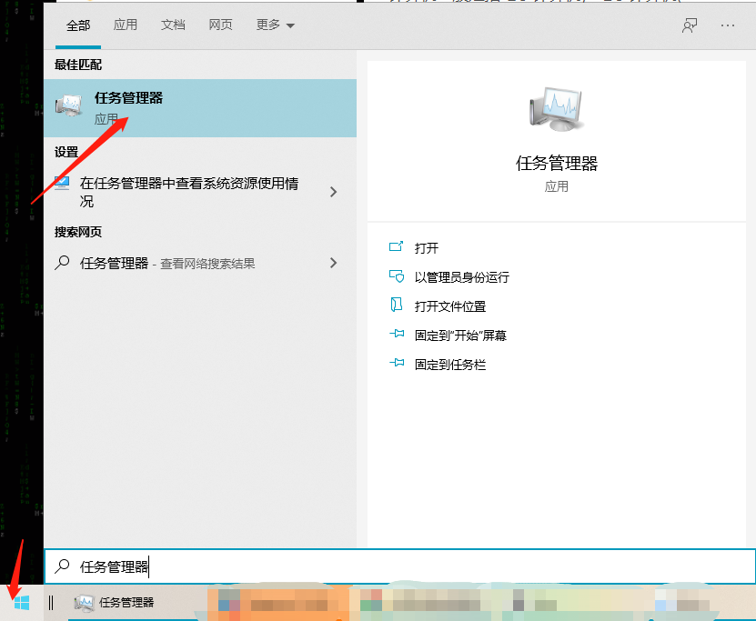
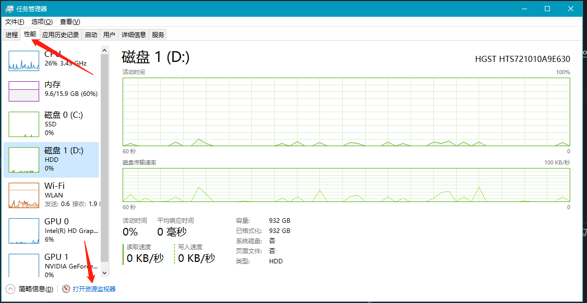
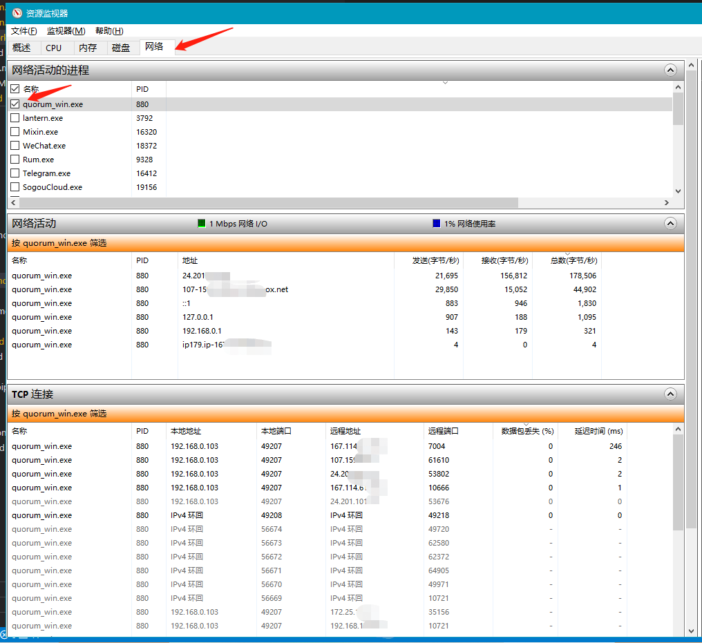
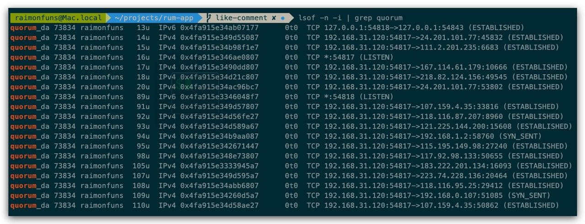

# 如何查看本机的网络活动？

## Windows

如果您需要查看 Rum 的网络活动，请您先开启 Rum 超过 5 分钟后，按如下步骤查看：

### 第一步，打开“任务管理器”

如果您不太理解如何打开任务管理器，可搜索： windows 如何打开任务管理器 ，比如[win10打开任务管理器的4种快捷方式](https://jingyan.baidu.com/article/e5c39bf5e1d52939d76033a1.html)

### 第二步，在刚才打开的“任务管理器”，点击到“性能”页卡，点击最下方的“打开资源监视器”

### 第三步，在刚才打开的“资源监视器”，点击到“网络”页卡，在“进程”项勾选“quorum_win.exe”，然后查看网络活动、TCP连接情况

如您愿意帮忙 debug，请把网络活动、TCP连接情况完整截图，发送给工作人员。

---

## Mac

如果您需要查看 Rum 的网络活动，请您先开启 Rum 超过 5 分钟后，按如下步骤查看：

### 第一步，打开“终端”

如果你不了解 Mac 的终端如何打开，请参考[该攻略](https://jingyan.baidu.com/article/f0062228cd8e95bad2f0c831.html)

### 第二步，在“终端”输入并执行以下命令行

`lsof -n -i | grep quorum`

如您愿意帮忙 debug，请把打印结果完整截图，发送给工作人员。

---

