# 基础操作图示

## 如何加入 Rum 群组？

### 第一步，下载种子文件，保存到您的电脑。

访问 [群组种子文件](rum-app/README.md) 下载或拷贝。

您也可以自建群组分发给他人，或通过他人提供给您的种子文件来加入群组。

### 第二步，打开 Rum 客户端，选择种子文件，加入群组。

点击“+”或“加入群组”：

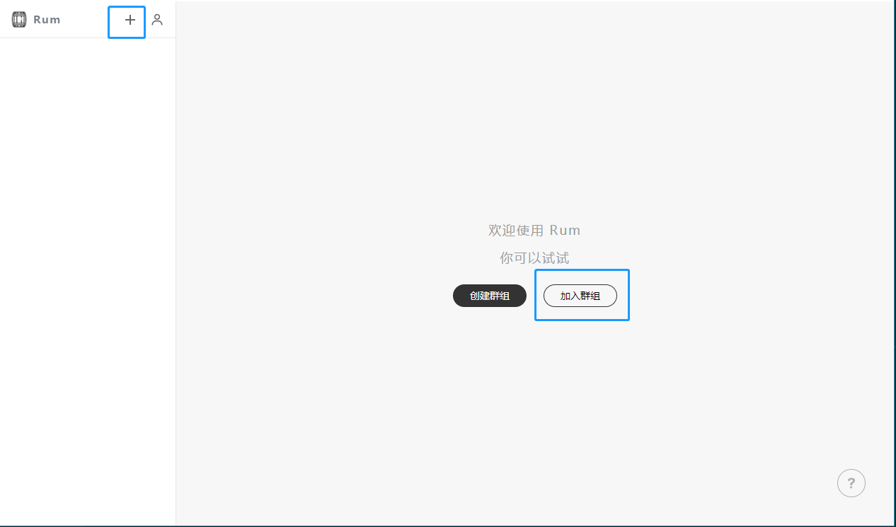

点击选择种子文件：

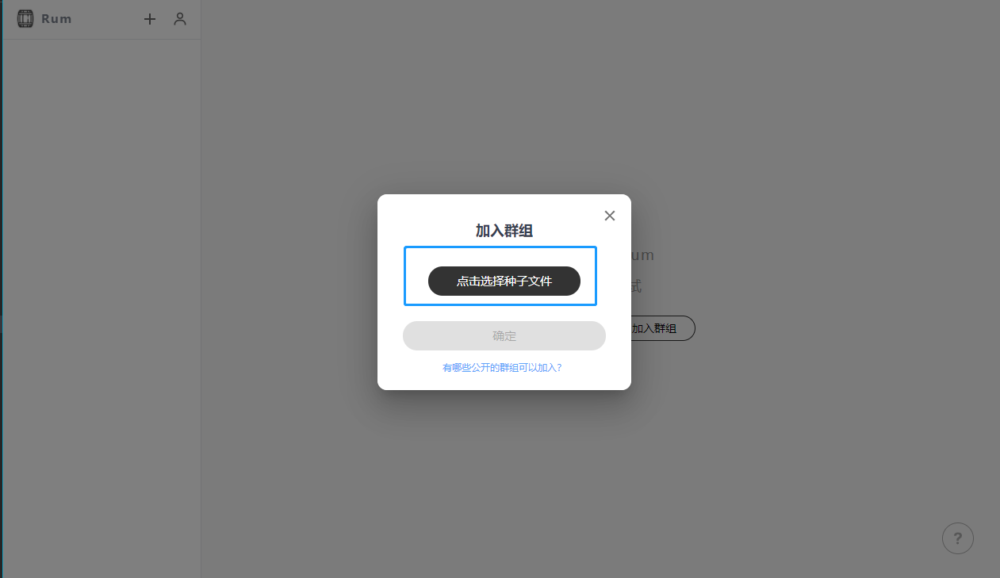

打开种子文件所在的目录，点击种子文件选中，然后点击“打开”：

请注意，种子文件以 seed 开头，以.json 结尾。

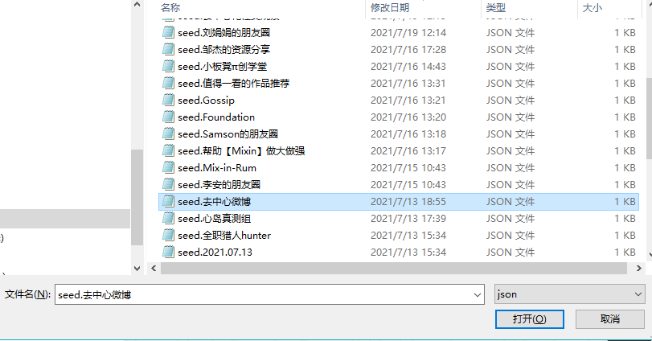

种子文件选中成功！点击确认：

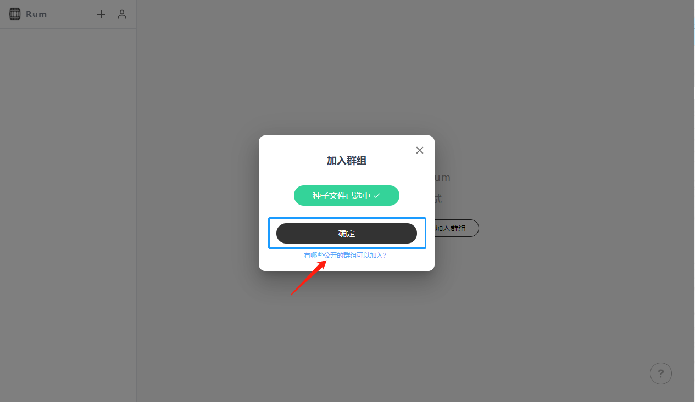

加入群组成功！请耐心等待与群组的其它节点建立连接并同步群组已有数据：

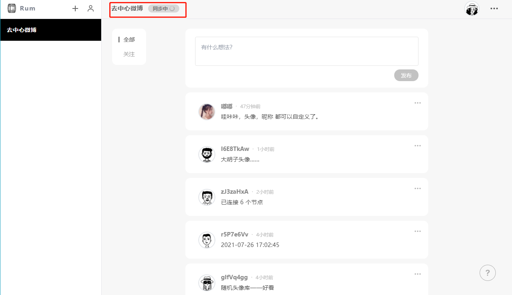

在群组的右上角，点击头像，可编辑资料：起一个响亮的名字，选择或上传头像。

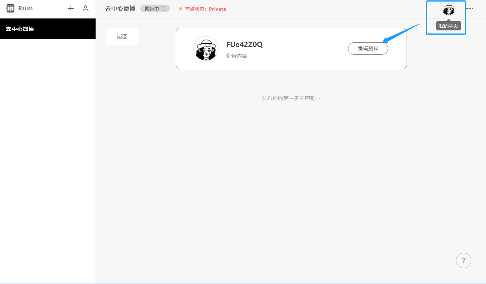

内容同步完成后，可发布内容；如有疑问，也可随时点击右下角的“？”查看帮助手册。

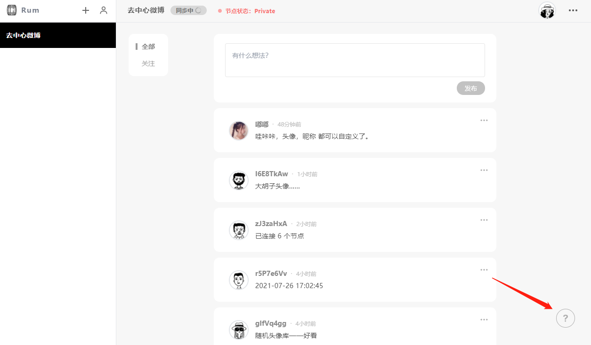

---

## 如何下载种子文件？

选中一个群组，在该群组页面的右上角，点击“…”，再弹出的页面中，点击“分享”：

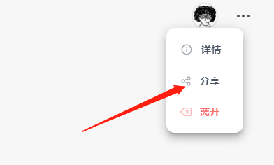

在弹出的窗口中，点击“下载种子文件”：

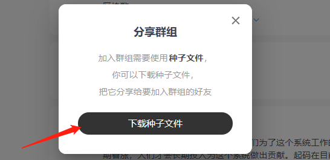

在弹出的窗口中，点击“保存”：

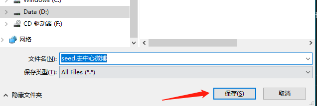

请留意，最好不要更改文件名，直接点击“保存”即可。

如果您执意更改文件名，请注意增加 ".json" 作为文件名后缀哦。

---

## 如何查看群组的区块数？

如果您需要查看您在某个群组已经同步到的区块数，以下是操作方式：

### 第一步，点击左侧群组列表，选中您要查看的群组

图示中，选中的群组呈黑底，即“去中心微博”

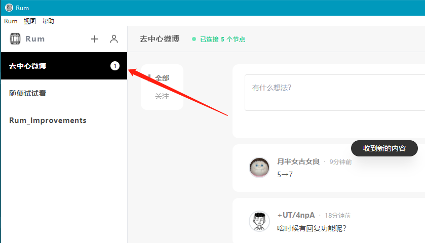

### 第二步，点击群组名字；或者点击右侧“……”点选“详情”

图示中，点击的是“去中心微博”这几个字

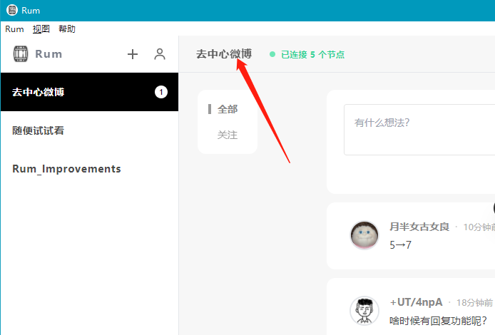

您也可以通过点击右上角的“……”，然后点选“详情”

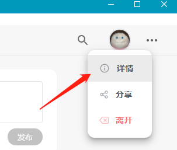

### 第三步，在弹出窗口查看区块数

图示中，“去中心微博”群组的区块数为 1416,

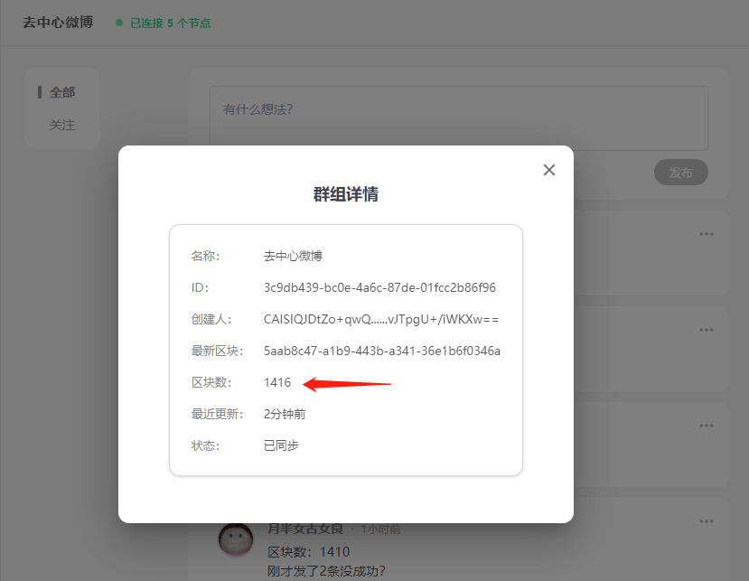

---
