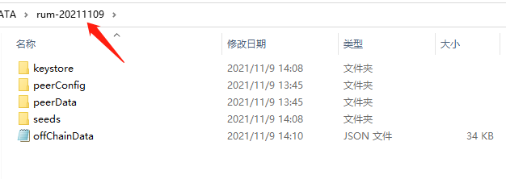
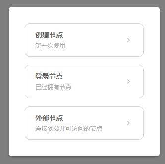

# 社区内测

[>>> Rum 信息导航](rum-app/about.md)

## 第一步，安装/更新

#### 电脑，最新版本号 ...

首次使用选择安装包下载并安装，后续可在 RUM 产品内检查更新、并按提示重启即可。每次启动时，RUM桌面也会自动检查是否有新版本。

- **Windows**：<a id="rum-app-win-link" href="" download>立即下载</a>
- **Mac（苹果电脑）**：<a id="rum-app-mac-link" href="" download>立即下载</a>
- **Linux**：<a id="rum-app-linux-link" href="" download>立即下载</a>

如果您在下载时遇到浏览器提示：RUM.exe已被阻止，请尝试更换浏览器重新下载，推荐使用 Chrome 谷歌浏览器。

#### 手机，最新版本号 ...

- **Andriod（安卓）**：<a id="rum-android-link" href="" download>立即下载</a>
- **Andriod(32位兼容）**：<a id="rum-android-32bit-link" href="" download>立即下载</a>

## 第二步，创建节点/登录节点

如果该设备自10 月以来首次使用RUM，请选择“创建节点”，请妥善保管好密码。

老用户可创建新节点。也可登录已有节点。RUM 在本地存储目录，如下图所示，请选中“rum-20211109”类似的文件夹即可。

开发者可选用“外部节点”功能：

## 第三步，加入种子网络

您可以自建种子网络，体验 RUM 的各项功能。您也可加入公开的种子网络。[>>>更多种子](rum-app/README.md)

拷贝种子后，粘贴到您的“加入种子网络”界面，**拷贝时，别漏掉上下两个花括号 { 和 } 吖**

等待同步时，可查看还有哪些种子网络可以加入~，能在 Rum 内直接点击加入哦。

## 第四步，发文分享、互动交流

加入种子网络后，请耐心等待建立连接、数据同步。之后就能发布内容、互动交流啦。

如需帮助，或建议反馈，请联系刘娟娟。（Mixin Id: 28576，微信号：qiaoanlu）

