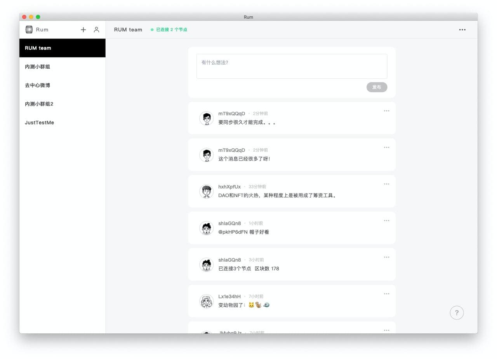
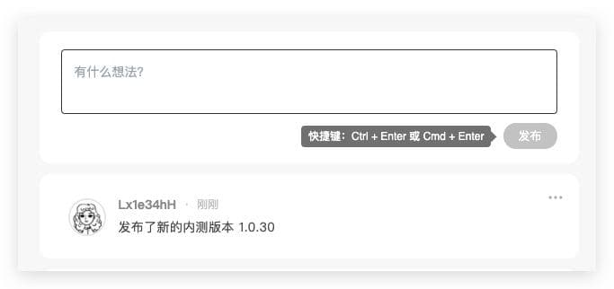
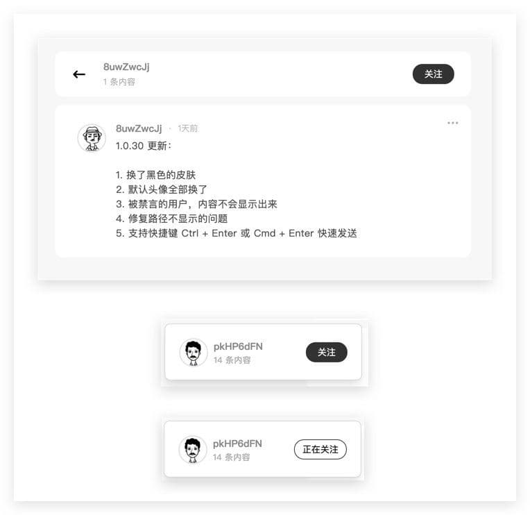
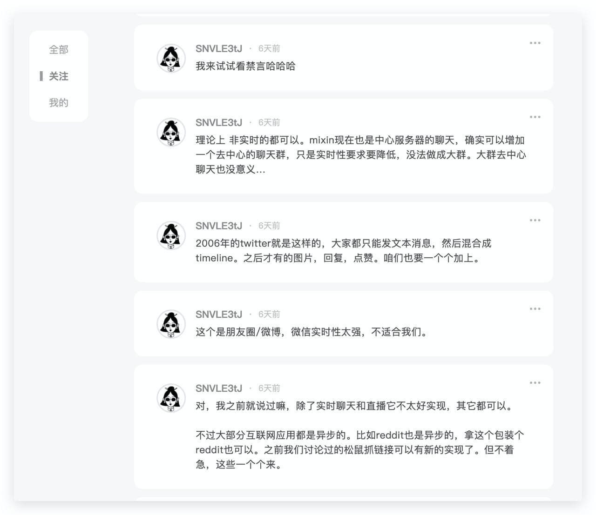
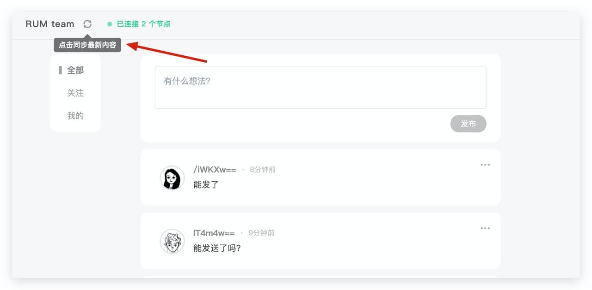
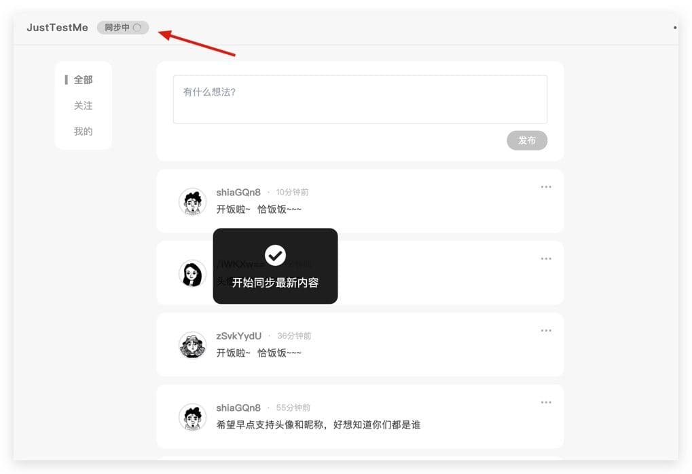
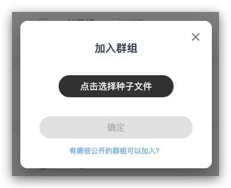
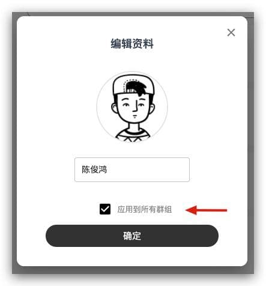
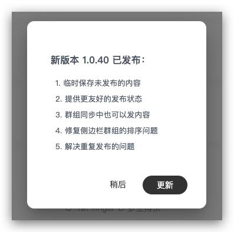

# 版本更新历史

## 手机应用版本历史

### 1.0.1

- 新增群组内搜索功能。

### 1.0.2 

- 调整新消息提醒样式与弹出时间。
- 支持复制消息内容。
- 修复屏蔽的人缓存失败问题。
- 添加部分错误信息友好提示。
- 添加App 更新提醒。
- Bug 修复。

### 1.0.3

- 使用 quorum main 分支的最新代码，提高节点启动速度。
- 支持群组内查看评论我和回复我的消息。

### 1.0.4

- 支持emoji。
- 优化同步状态的显示。
- 折叠过长内容与评论。
- 解析URL内容。
- 回到顶部。
- 文本“群组”改为“种子网络”。

## 桌面应用V1.2版本历史

### 1.2.0

- 使用 quorum main 分支的最新代码
- 修复同步按钮不显示的问题
- window 系统后台运行会给提示
- 修复群组详情空白的问题

### 1.2.2

- 升级网络协议
- 优化用户体验

### 1.2.3

- 当网络断开时，会自动尝试重新连接
- 显示精确的同步状态

### 1.2.5

- 提高节点启动速度
- 优化评论的加载过程

---

## 桌面应用更早版本历史

### 1.0.28

已支持功能：

- 节点（peer）：自动初始化、手动重置
- 组（chain group）：创建新组，加入已有的群组，退出群组，解散群组，分享群组
- 内容发布（content）：支持文本，最多限5000字
- POA共识：群组创建人在线时自动出块。所有组员均可发布内容，群组创建人可禁言组员

### 1.0.29

更新如下：

- 支持选择储存目录，一个目录等于一个节点；如果要开新节点，那就指定一个新目录；选择已存在的目录，可读取旧数据
- 前端支持分页，数据再多也不卡了
- 优化了一些提示文本，修复了几个 小bug

### 1.0.30

更新如下：

- 更换为黑白配色的皮肤
- 默认头像全部换了
- 被禁言的用户，内容不会显示出来
- 支持快捷键 Ctrl + Enter 或 Cmd + Enter 快速发送
- 修复储存路径不显示的问题

### 1.0.31

更新如下：

- 新增群组内关注功能和个人页。现在用户可在群组内点击查看任意某个用户发布的所有内容；可关注部分人并切换查看这部分人所发布的内容

### 1.0.32

更新如下：

- 优化网络状况，解决同步数据的问题
- 可以手动触发同步

（主要是网络相关）

### 1.0.33

更新如下：

- 修复头像和昵称会偶然改变的问题
- 缓存正在发布的内容，只要点发布，无论成功还是失败，内容都不会丢
- 失败的内容可以点一下按钮，一键重发
- 新增网络状态面板

### 1.0.34

更新如下：

- 把旧的种子数据做了一次迁移，以兼容旧的种子数据文件（修复早期版本创建的群组分享时提示找不到种子文件的问题）

### 1.0.35

更新如下：

- 可以修改头像和昵称：每个群组都可分别设定昵称与头像
- 数据层升级，所有内容需要重新同步一次（速度很快的）

### 1.0.36

更新如下：

- 新增头像素材库
- 可以把头像和昵称同步到所有群组
- 修复退出群组出现白屏的问题
- 显示更详细的发布时间
- 侧边栏的群组列表，按照最新消息的顺序排列
- 支持自动更新，今后如果有新版本发布了，会提示自动更新，不再需要手动安装

### 1.0.40

更新如下：

- 临时保存未发布的内容
- 提供更友好的发布状态
- 群组同步中也可以发内容
- 修复侧边栏群组的排序问题
- 解决重复发布的问题

重启 Rum 就能自动更新版本哦~

### 1.0.41

更新如下：

- 修复若干个小问题
- 升级数据层
- 需要重新同步一遍所有内容

### 1.0.42

更新如下：

- 修复程序无法顺利退出的问题

### 1.0.43

更新如下：

- 可以搜索群组内容
- 优化自动更新功能：可点击左上角的菜单“检查更新”来检查版本更新

### 1.0.44

更新如下：

- 后台自动触发同步功能，提升获取内容的稳定性和流畅度
- 服务 API 从 http 升级为 https

### 1.0.45

更新如下：

- 修复升级之后启动失败的问题

### 1.0.46

更新如下：

- 优化网络协议

### 1.1.0

更新如下：

- 可以评论
- 可以查看评论、回复的消息提醒
- 调整关注模式，默认显示所有内容，不感兴趣的人可以单独隐藏掉
- 数据层调整升级，所有内容需要重新加载一次（请放心，这个速度很快）
- 手动同步群组数据按钮加回来了