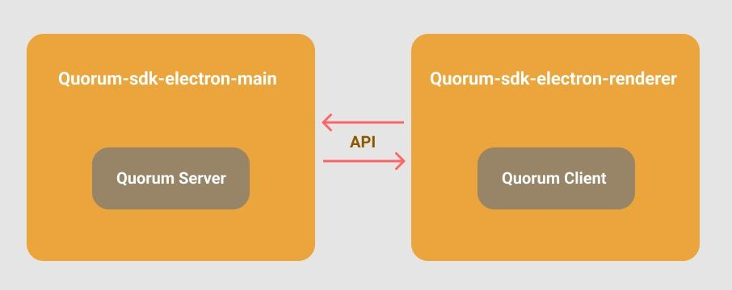

# 介绍

---

## 什么是 RUM
[RUM](https://github.com/rumsystem/quorum) 是 [RumSystem](https://rumsystem.net/) 官方团队主导开发的整套开源 P2P 技术底层解決方案（全称 QuoRum ）。 

## 什么是 Electron
[Electron](https://www.electronjs.org) 是一个使用 JavaScript, HTML 和 CSS 等 Web 技术创建原生程序的框架。

## 什么是 RUM-SDK
RUM-SDK 实现了对 RUM 的封装，暴露出了更友好的 api，使基于 Electron 开发的桌面客户端更方便的集成 RUM。

RUM-SDK 包含以下两部份：
1. [quorum-sdk-electron-main](https://github.com/rumsystem/quorum-sdk-electron-main)
2. [quorum-sdk-electron-renderer](https://github.com/rumsystem/quorum-sdk-electron-renderer)

**quorum-sdk-electron-main** 用于 Electron 应用的主进程，封装了对 quorum 进程的直接操作，对由 quorum-sdk-electron-render 创建的客户端实例进行响应。

**quorum-sdk-electron-renderer** 用于 Electron 应用的渲染进程，封装了对 quorum-sdk-electron-main 的相关请求，暴露出友好的 api，使得对 quorum 的操作更加直接与易于理解。

